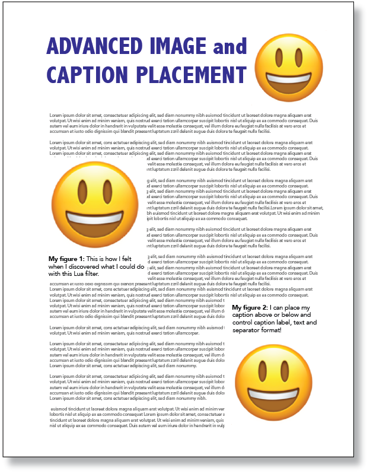

[comment]: # (This is the Master readme file, written in a more standard MacFarlane markdown format rather than in 'gfm' (Github-Flavored Markdown). This allows using Pandoc to create other doc format versions of this, such as Word .docx, html, epub and pdf. If this were a github-type markdown file to begin with it could not undergo such conversions as a github-version has its own internal document links, which do not work for other formats. Therefore, we maintain this 'master' markdown containing such links and then use Pandoc to generate a Git-specific .md version, which also displays correctly on github.)

# A solution for enhanced image and caption control

The *image-placement.lua* Pandoc filter is intended to address commonly encountered shortcomings when displaying images and captions in documents created by Pandoc from markdown documents. Now you can specify a variety of image and caption parameters directly within markdown images statements. Here are two brief examples:

{width=100%}

# Document formats supported

It is assumed you already have installed Pandoc. If not, information is provided [here](https://pandoc.org/installing.html).

Currently this filter supports Pandoc converson of markdown documents to

- html — For web
- docx — For MS Word documents
- pdf — For convenient document exchange. If you intend to create pdf or latex documents, you will need to have *LaTex* installed. Click [here](https://www.latex-project.org/get/) for more information. The '[wrapfig](https://www.ctan.org/pkg/wrapfig?lang=en)' package is required for text-wrap. (For using with pdf/latex docs, see *[Special considerations for floated images in latex/pdf documents](#using-wrapfig)*, below.)
- latex — For typesetting and pdf conversion.
- epub — For commonly available e-published format
- gfm — For creating Github-flavored markdown `.md` files (limited support). Although Github filters out most attributes, this filter does provide limited capability for sizing and positioning graphics and captions to left, right and center. If you are viewing this via a github Readme.md file, it was created with Pandoc using this place-image lua filter.

### Example file included

The master document used to create this *gfm* markdown readme.md is named **README-master.Rmd**. (Although it is in the *R* flavor of markdown, it is substantially identical to a *.md* format.) It is included in the github repository so you can view how the YAML headers are set up for the various output formats and how both global and individual image parameters are set.

# Parameters you can control

The place-image filter allows you to specify these parameters:

## For images and captions

- width -- Image width
- position -- Horizontal position on page (left, center, right, float-left, float-right; floats are text-wrapped.)
- h_padding, v_padding -- Padding between image, caption and surrounding text.
- cap_width -- Width of caption text. If expressed as percent, will be relative to image width.
- cap_space -- Space between caption and image.
- cap_position -- Vertical positon relative to image: above or below. Default is above.
- cap_h_position -- horizontal position of caption block relative to image (left, center, right). Default is center.
- cap_text_align -- If specified: left, center, right
- cap_text_size -- If specified: small, normal, large. Default is normal.
- cap_text_font -- If specified, font must be among system fonts.
- cap_text_style -- If specified: plain, italic, bold, bold-oblique, bold-italic. Default is plain.
- cap_label -- If specified, can be any, e.g., "Figure", "Photo", "My Fantastic Table", etc. Number following label will be respective to the label.
- cap_label_style -- If specified: plain, italic, bold, bold-oblique, bold-italic. Default is plain.
- cap_label_sep -- If specified, indicates separater between caption label number and caption, e.g., ":&nbsp;"
- close_frame -- (PDF/latex documents only) — Fixes occasional failure by latex to close the wrapping-frame below an image.
- adjust_frame_ht -- (PDF/latex documents only) — Used to compensate for inaccurate wraps in Pandoc conversions to pdf and latex formats. It has no effect on other formats.
- pdf_anchor_strict -- (PDF/latex documents only) — Indicates if pdf/latex image may be moved automatically if too close to a top/bottom margin.
- md_cap_ht_adj -- (Markdown/gfm documents only) — Allows tweaking the height of the vertical caption container, should you find a caption failing to be contained properly.

## For headings

- keep_with_next -- Used with *Headings* to keep them from being 'orphaned' at bottom of page.

## Control globally or just individually

This filter lets you specify display of images in two ways: (1) for each image and (2) for all images, globally.

### You can specify params for each [specific image](#image_specific)

Each markdown image statement can include desired parameters, which will override any default or global parameters. For example, you can specify an image width, its caption label and caption position like this:

`{width=2.5in cap_label="My Figure" cap_position=above}`

### ... or globally, for *all* images

You can affect all images within a global "[imageplacement](#global-params)" statement in the YAML Meta section at the top of the markdown document, e.g.,

`imageplacement: width=45%, cap_label="My Figure", cap_position=above`

### You can even specify different image params for different document types

You can preface any parameter with a document format identifier and that parameter will override any default or other image parameter for that document type. For example, the following will set the image width at 50% of page width for any supported format except pdf and docx images, which will be sized separately:

`{position=float-right width=50% pdf:width=40% docx:width=45%}`

Supported document format identifiers include the following:

- html: — For web
- docx: — For MS Word documents
- pdf: — For convenient document exchange
- latex: — For typesetting and pdf conversion
- epub: — For commonly available e-published format
- gfm: — For creating Github-flavored markdown `.md` files (limited support)

## Parameters for a specific image{#image_specific}
  
Parameters in *specific image* statements must *not* be separated by commas; doing so will cause Pandoc to throw up in its mouth, with unexpected results. (This contrasts with how global parameters must be separated *with* commas within the YAML Meta statement. I know, I know — but that's out of my control.)

The following illustrates how to easily size a specific image to 45% of page width, float it to the right with text wrapped around it, and place the caption *below* (rather than above) the image.

`{width=45% position=float-right cap_position=below}`

These and other available parameters are [listed below](#commands-table).

## Global parameters applying to *all* doc images{#global-params}

Note, global parameters must be separated *with* commas within the global YAML Meta imageplacement statement at the top of the markdown document, for example,

`imageplacement: cap_label="Figure", cap_label_sep=":_"`

Global parameter(s) apply to *all* images or any parameter not otherwise specified in a specific image statement. For example, you may wish to include a standard label for all images, such as  "My Figure 1: " to precede each image caption. You can accomplish this with this 'imageplacement' statement in your YAML header:

<pre><code>
---
title: "Plan for Controlling Weather"
imageplacement: cap_label="My Figure", cap_label_sep=":_"
output:
  html_document:
    pandoc_args: ["--lua-filter=place-image.lua"]
    css: "css-md/mdstyles.css"
    template: "templates/default.html5"
params:
  author: Your Name
---
</code></pre>

This will cause every image to be preceded by the label "My Figure" followed by a space and sequence number particular to the label. The parameter line

`cap_label_sep=":_" `

will cause a colon and space to separate that from the caption, as in "My Figure 3: This is my caption..." 

You can cause the label to be bold face by adding the "cap_label_style" parameter, for example,

`imageplacement: cap_label="My Figure", cap_label_sep=":_", cap_label_style=bold`

This would produce a caption like this: "**My Figure 3:** This is my caption..."

> Note 1 — unlike with parameters listed with images, image parameters in the YAML header must be separated by commas, due to the way the Lua language scans the YAML header for parameters; failing to include commas may cause Pandoc to pee on itself, causing a "scan" error and high blood pressure.

> Note 2 — Note the "cap_label_sep" parameter of ":\_". The underscore character following the colon indicates a space "&nbsp;" character. This is because an actual space character in a YAML parameter string also can cause a "scan" error. Therefore, use the "_" underscore character to indicate a space.

# Image parameter details{#commands-table}

Below is a table of parameters you can include. Wherever a size dimension is required, the number must be followed immediately by one of "%", in", "cm", "mm" or "px". (Ensure there are no spaces between the number and dimension, e.g., "350px". "350 px" may produce unexpected results.

- % — percentage of parent width
- in — inches
- cm — centimeters
- mm — milimeters
- px — pixels (at 96 per-inch)

Parameters appear between curly brackets ('{ }') immediately after a markdown element; they may be placed in any order, separated by a space. For example:

`{position=float-left cap_position=below width=50%}`
&nbsp;

or

`My heading{keep_with_next=5}`

## Parameters you can use 

### For images and captions

| Parameter  | Notes  | Default  | Examples  |
| :-------- | :------------------- | :---- | :-------------- |
| width  | Image width  | 50%  | width=35%, width=200px, width=3cm, width=2.5in  |
| position  | Horizontal position relative to page  | center  | Options: left, center, right, float-left, float-right; floats are text-wrapped. Examples: position=center, position=float-right  |
| h_padding  | Horizontal separation between image and surrounding text  | 0.15in  | h_padding=0.15in, h_padding=4mm, h_padding=10px, etc.  |
| v_padding  | Vertical separation between image and surrounding text  | 0.15in  | v_padding=0.12in, v_padding=.3cm, v_padding=9px, etc.  |
| cap_width  | Width of caption. If percent, relative to image width  | 90%  | cap_width=100%, cap_width=250px, cap_width=1in, etc.  |
| cap_space  | Space between caption and image  | 0.15in  | Example: cap_space=0.12in  |
| cap_position  | Caption vertical position relative to image  | above  | Options: above, below Example: cap_position=below  |
| cap_h_position  | Caption horizontal alignment relative to image (caption itself may only be above or below)  | center  | Options: left, center, right Example: cap_h_position=left  |
| cap_text_align  | Caption text alignment  | left  | Options: left, center, right Example: cap_text_align=left  |
| cap_text_size  | Allows tweak of caption text size relative to body text  | small  | Options: small, normal, large Example: cap_text_size=normal  |
| cap_text_font  | If specified, font must be a registered system font; use sparingly  |  | Options may include any system font. Examples: cap_text_font=Helvetica, cap_text_font=Arial, cap_text_font=Times, etc.  |
| cap_text_style  | Caption text style  | plain  | plain, italic, bold, oblique, bold-oblique  |
| cap_label  | Allows specifying a numbered custom label that appears before caption  | none  | Options may include any string. For example, 'cap_label="Figure"' will result in a label like "Figure 4". 'cap_label="Photo"' will produce a lable like "Photo 1", etc. Note: You must enclose your label within quotes, e.g., "My Photo". |
| cap_label_sep&nbsp;&nbsp; | Allows specifying a custom separator character(s) between the numbered custom label and caption.  | &nbsp;&nbsp;":&nbsp;" | By default, label and caption are separated by a colon followed by a space character, like this:  "Figure 4: My caption..." Ensure you enclose your custom separater within quotes if it will contain any space character and use the underscore character to indicate the space. For example, the following shows a custom separator, a hyphen surrounded by space characters: 'cap_label_sep="\_-\_"' It will appear as, for example, "Photo 2 - My caption..." |
| close_frame | (PDF/latex documents only) — Sometimes text is improperly wrapped around a floated image, resulting in a failure to restore the original margin immediately after the image. Use this parameter *only* where such problem exists as using indiscriminately may cause unexpected results elsewhere in the document. | false | close_frame=true |
| adjust_frame_ht  | (PDF/latex documents only) — This allows tweaking the wrap height for a wrapped image in latex/pdf formats. Sometimes latex misjudges wrap height and text may flow into the image from below or there may be too much empty space below. Should this occur, you may try specifying different equialent line heights for that image, e.g., "10", "15", etc. (You also may wish to tweak the pdf/latex image width in such cases, e.g., "pdf:width=42%" instead of "width=45%.") |  | This parameter affects *only* latex/pdf images. Examples: adjust_frame_ht=10, adjust_frame_ht=12, pdf:adjust_frame_ht=15, etc.  |
| pdf_anchor_strict | (PDF/latex documents only) — Indicates if pdf or latex image may be moved automatically if too close to a top/bottom margin. By default, this is set to *false*, which relaxes restrictions and allows image to be moved to accommodate normal latex page composition. | false | Examples: pdf_anchor_strict=true |
| md_cap_ht_adj | (Markdown/gfm documents only) — Allows tweaking the height of the vertical caption container, should you find a caption failing to be contained properly. Values may be between -20 and 20.|  | Examples: md_cap_ht_adj=3, md_cap_ht_adj=-4 |

### For headings

| Parameter  | Notes  | Default  | Examples  |
| :-------- | :------------------- | :---- | :-------------- |
| keep_with_next| Prevents headings from being orphaned when near page bottom. If you find a heading alone, it's usually because latex encountered an image(s) that complicated optimum page composition. In such case, use *keep_with_next* and specify a number of lines exceeding the equivalent number of lines between the heading and page bottom. | 4 | If near page bottom, e.g., `keep_with_next=5`. If farther up, `keep_with_next=30` |

## Supports header YAML *papersize* and *geometry* parameters

Papersize can be specified as any of

- letter
- legal
- ledger
- tabloid
- executive
- ansi c
- ansi d
- ansi e
- a0
- a1
- a2
- a3
- a4
- a5
- a6
- a7
- a8

For example

<pre><code>
---
title: "Plan for Controlling Weather"
papersize: "letter"
geometry: "left=1in, right=1in, top=.75in, bottom=.75in, footskip=1cm"
output:
  pdf_document:
    template: "./templates/eisvogel.latex"
    pandoc_args: ["--lua-filter=place-image.lua"]
params:
  author: Your Name
---
</code></pre>

# Setting up to use

It is assumed the user already has installed Pandoc. If not, information is provided [here](https://pandoc.org/installing.html).

If you intend to also create pdf or latex documents, you will also need to have *LaTex* installed. Click [here](https://www.latex-project.org/get/) for more information.

You should place your markdown document into a folder along with the place-image.lua pandoc filter and supporting folders.

{width=75% gfm:width=60% cap_position=above position=center}

# Invoking filter from Pandoc

This filter can be invoked on the command line with the "--lua-filter" option, e.g., "\-\-lua-filter=place-image.lua". An example might be

`pandoc -f markdown -t html myfile.md -o myfile.html --css=./css-md/mdstyles.css --template=templates/default.html5 --lua-filter=./place-image.lua -s`

Alternatively, if you are working within an environment like R-Studio that runs Pandoc, it may be included in the YAML header, for example,

<pre><code>
---
title: \"My extraordinarily beautiful document\" 
output:
  html_document:
    pandoc_args: [\"--lua-filter=place-image.lua\"]
---
</code></pre>

# Considerations for floating images in markdown/gfm documents{#using-md}

{width=40% pdf:width=35% position=float-right cap_position=above cap_text_align=center adjust_frame_ht=15}

Natively, Pandoc does not create floated images for markdown documents and some *flavors* of markdown further limit image and caption formatting. The place-image filter does allow images to be floated with most markdown *flavors* but with some limitations.

Any captions for floated images may appear only along-side, rather than above or below. Also, precise spacing with *v-padding* and *h-padding* may be disabled.

Should you find a caption failing to be contained properly, the parameter *md_cap_ht_adj* is provided to allow tweaking the invisible container height. Try any value between -20 and 20. For example:

``md_cap_ht_adj=3`` 
``md_cap_ht_adj=-4``

# Special considerations for floating images in latex/pdf documents{#using-wrapfig keep_with_next=15}

## Include these packages

For Pandoc conversion into Latex and pdf, these three package statements should be included in the latex template file. (For your convenience, they already are in the "default.latex" and "eisvogel.latex" templates in the "templates" folder on this site.)

`\usepackage{layouts}` allows calculating width relative to latex/pdf page width

`\usepackage{wrapfig}` enables text wrap-around of figures 

`\usepackage[export]{adjustbox}`  must include to enable additional positioning

Again, these package statements already are in the following two template versions included on this site, either of which you can use for Pandoc conversion into latex/pdf documents:

- default.latex — The default latex template by Pandoc author John MacFarlane, to which I added those statements.
- eisvogel.latex — The latex template by Pascal Wagler, based upon template by Pandoc author John MacFarlane. This is a superb latex template I prefer for its expanded capabilities.

## Issues in latex/pdf documents

There are some known issues when floating images (with text wrap) for pdf and latex documents that may elicit every disease known to medical science. Factors such as image location, caption length and proximity to a table can cause problems. Ensure you review the caveats and hints below if you plan to output to pdf/latex.

### Use this procedure

After creating your markdown and viewing the rendered pdf,

1. Scan your document for floated images where wrapped text fails to close around the image bottom — where blank space persists below the image. Wherever you find such an image, append the `close_frame=true` parameter immediately following the image markdown, for example: \    
`{width=40% position=float-right close_frame=true}` \   
Otherwise, do not use *close_frame*, unless needed to avoid unpleasant side-effects.

2. After repairing unclosed floats as above, it's not uncommon for the invisible frame around a floated image — around which text is wrapped — to be slightly too small or too large, causing text below to be too close or too far from the image bottom. Wherever you find this, use an *adjust_frame_ht* parameter and try different numbers representing the number of lines equivalent to image + caption height, e.g., "10", "15", etc., until the wrap height is correct. Here's an example of using the 'adjust_frame_ht' parameter: \    
`{position=float-right width=40% cap_label="My Figure" adjust_frame_ht=12}`

3. Scan your rendered document for any orphaned headings (those appearing by themselves — usually near a page bottom). Append the *keep_with_next* parameter immediately after such a heading and try various values that will advance it to the next page to rejoin text. Try specifying a number representing the number of lines exceeding the equivalent number of lines between the heading and page bottom: perhaps '4' if near page bottom, or '30' if farther up. For example, \   
`## This is my heading{keep_with_next=15}`

Now, review your re-rendered document again and iterate the steps above if needed.

### Avoiding issues

#### Use percentage for image width

The fewest issues should be encounted by using percentage ("`%`") rather than indicating image widh using "in", "cm", "mm", or "px". For example:

`width=40%`

#### Avoid placing floated images too close together

Whenever the pandoc converter encounters a floated image too close to a top or bottom margin, it will move the image, which may unexpectedly cause overlap with another image; Armageddon may follow.

#### Don't place images by tables

Latex seems to get confused if it finds a floated image where any part of a table may wrap around it. Better keep tables and images apart.

A wrapped image that causes text from a table to float around it may cause a margin below it to change. Move or resize the image to ensure its bottom does not extend into a table.

#### Don't place floated image immediately before a heading.
For some reason, this may cause latex to lose track of margins, indents and its mind. 

#### Don't override the *pdf-anchor-strict* default

By default, the *pdf_anchor_strict* parameter is set to *false*, which allows latex to move images that are too close to a top or bottom margin to another page. It is strongly suggested you do not override this parameter.

### Use the format-specific *'`pdf:`'* prefix for pdf/latex image parameters

For pdf and latex documents, you'll want to make liberal use of the document type prefix *'pdf:'* with your image parameters. This will cause the parameter value to override a default or specified value for a pdf/latex image. For example, if you've specified a width of 50% for a *float-right* image but the pdf version extends below the bottom margin, you may be able to resolve the issue by specifying a different image width for pdf/latex documents, like this:

`{position=float-right width=50% pdf:width=35% cap_label="My Figure"}`

This should cause the image to appear at 35% width for a pdf or latex doc format, while it will appear at 50% width for any other doc format.

Alternatively, you may elect not to float the image in a pdf/latex doc with the position parameter like this:

`{position=float-right pdf:position=center width=40% cap_label="My Figure"}`

The `prefix` modifier can be a powerful means of adjusting images that appear problematic in pdf (or other) formats.

#### I hope you find some of this useful. I welcome any corrections, feedback and suggestions!

George
