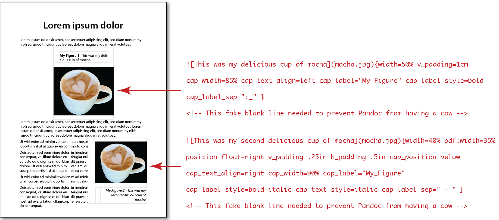

# A solution for enhanced image & caption control

The *image-placement.lua* Pandoc filter is intended to address commonly
encountered shortcomings when displaying images in documents created by
Pandoc from markdown documents. Now you can specify a variety of image
and caption parameters directly within markdown images statements. Here
are two brief examples:

 

This filter allows you to specify these parameters:

-   width – Image width
-   position – Horizontal position on page (left, center, right,
    float-left, float-right; floats are text-wrapped.)
-   h_padding, v_padding – Padding between image, caption and
    surrounding text.
-   cap_width – Width of caption text. If expressed as percent, will be
    relative to image width.
-   cap_space – Space between caption and image.
-   cap_position – Vertical positon relative to image: above or below.
    Default is above.
-   cap_h\_position – horizontal position of caption block relative to
    image (left, center, right). Default is center.
-   cap_text_align – If specified: left, center, right
-   cap_text_size – If specified: small, normal, large. Default is
    normal.
-   cap_text_font – If specified, font must be among system fonts.
-   cap_text_style – If specified: plain, italic, bold, bold-oblique,
    bold-italic. Default is plain.
-   cap_label – If specified, can be any, e.g., “Figure”, “Photo”, “My
    Fantastic Table”, etc. Number following label will be respective to
    the label.
-   cap_label_style – If specified: plain, italic, bold, bold-oblique,
    bold-italic. Default is plain.
-   cap_label_sep – If specified, indicates separater between caption
    label number and caption, e.g., “: ”
-   pdf_adjust_lines – Used to compensate for inaccurate wraps in Pandoc
    conversions to pdf and latex formats. It has no effect on other
    formats.

This filter lets you specify display of images in two ways: (1) for each
image and (2) for all images, globally.

### You can specify params for each [specific image](#image_specific)

Each markdown image statement can include desired parameters. For
example, you can specify an image width, its caption label and caption
position like this:

`{width=2.5in cap_label="My Figure" cap_position=above}`

A parameter for a specific image will override any global parameter.

### … or globally, for *all* images

You can affect all images within a global
“[imageplacement](#global-params)” statement in the YAML Meta section at
the top of the markdown document, e.g.,

`imageplacement: width=2.5in, cap_label="My Figure", cap_position=above`

### You can even specify different image params for different document types

You can preface any parameter with a document format identifier and that
parameter will override any default or other image parameter for that
document type. For example, the following will set the image width at
50% of page width for any supported format except pdf and docx images,
which will be sized separately:

`{position=float-right width=50% pdf:width=40% docx:width=45%}]`

Supported document format identifiers include the following:

-   html:
-   docx:
-   pdf:
-   latex:
-   epub:

## Parameters for a specific image

Parameters in *specific image* statements must *not* be separated by
commas; doing so will cause Pandoc to throw up in its mouth, with
unexpected results. (This contrasts with how global parameters must be
separated *with* commas within the YAML Meta statement. I know, I know —
but that’s out of my control.)

The following illustrates how to easily size a specific image to 45% of
page width, float it to the right with text wrapped around it, and place
the caption *below* (rather than above) the image.

`{width=45% position=float-right cap_position=below}`

These and other available parameters are [listed
below](#commands-table).

## Global parameters applying to *all* doc images

Note, global parameters must be separated *with* commas within the
global YAML Meta imageplacement statement at the top of the markdown
document, for example,

`imageplacement: cap_label="Figure", cap_label_sep=":_"`

Global parameter(s) apply to *all* images or any parameter not otherwise
specified in a specific image statement. For example, you may wish to
include a standard label for all images, such as “My Figure 1:” to
precede each image caption. You can accomplish this with this
‘imageplacement’ statement in your YAML header:

<pre><code>
---
title: "Plan for Controlling Weather"
imageplacement: cap_label="My Figure", cap_label_sep=":_"
output:
  html_document:
    pandoc_args: ["--lua-filter=place-image.lua"]
    css: "css-md/mdstyles.css"
    template: "templates/default.html5"
params:
  author: Your Name
---
</code></pre>

This will cause every image to be preceded by the label “My Figure”
followed by a space and sequence number particular to the label. The
parameter line

`cap_label_sep=":_"`

will cause a colon and space to separate that from the caption, as in
“My Figure 3: This is my caption…”

You can cause the label to be bold face by adding the “cap_label_style”
parameter, for example,

`imageplacement: cap_label="My Figure", cap_label_sep=":_", cap_label_style=bold`

This would produce a caption like this: “**My Figure 3:** This is my
caption…”

> Note 1 — unlike with parameters listed with images, image parameters
> in the YAML header must be separated by commas, due to the way the Lua
> language scans the YAML header for parameters; failing to include
> commas may cause Pandoc to pee on itself, causing a “scan” error and
> high blood pressure.

> Note 2 — Note the “cap_label_sep” parameter of “:\_”. The underscore
> character following the colon indicates a space “ ” character. This is
> because an actual space character in a YAML parameter string also can
> cause a “scan” error. Therefore, use the “\_” underscore character to
> indicate a space.

# Document formats supported

Currently this filter supports Pandoc converson of markdown documents to

-   html
-   docx
-   pdf — The ‘[wrapfig](https://www.ctan.org/pkg/wrapfig?lang=en)’
    package is required for text-wrap. (For using with pdf/latex docs,
    see [Using wrapfig](#using-wrapfig), below.)
-   latex — The ‘[wrapfig](https://www.ctan.org/pkg/wrapfig?lang=en)’
    package is required for text-wrap. (For using with pdf/latex docs,
    see [Using wrapfig](#using-wrapfig), below.)
-   epub

# Image parameter details

Below is a table of parameters you can include in your markdown image
specifier. Wherever a size dimension is required, you can use any of the
following dimensions. (Ensure there are no spaces between the number and
dimension, e.g., “350px”. “350 px” may produce unexpected results.

-   % — percentage of parent width
-   in — inches
-   cm — centimeters
-   mm — milimeters
-   px — pixels (at 96 per-inch)

You may enter parameters in any order, for example:

`{position=float-left cap_position=below width=50%}`
 

## Parameters you can use

| Parameter          | Notes                                                                                                                                                                                                                                                                                                                                                                                                                              | Default | Examples                                                                                                                                                                                                                                                                                                                                                                                                                                                                          |
|:-------------------|:-----------------------------------------------------------------------------------------------------------------------------------------------------------------------------------------------------------------------------------------------------------------------------------------------------------------------------------------------------------------------------------------------------------------------------------|:--------|:----------------------------------------------------------------------------------------------------------------------------------------------------------------------------------------------------------------------------------------------------------------------------------------------------------------------------------------------------------------------------------------------------------------------------------------------------------------------------------|
| width              | Image width                                                                                                                                                                                                                                                                                                                                                                                                                        | 50%     | width=35%, width=200px, width=3cm, width=2.5in                                                                                                                                                                                                                                                                                                                                                                                                                                    |
| position           | Horizontal position relative to page                                                                                                                                                                                                                                                                                                                                                                                               | center  | Options: left, center, right, float-left, float-right; floats are text-wrapped. Examples: position=center, position=float-right                                                                                                                                                                                                                                                                                                                                               |
| h_padding          | Horizontal separation between image and surrounding text                                                                                                                                                                                                                                                                                                                                                                           | 0.15in  | h_padding=0.15in, h_padding=4mm, h_padding=10px, etc.                                                                                                                                                                                                                                                                                                                                                                                                                             |
| v_padding          | Vertical separation between image and surrounding text                                                                                                                                                                                                                                                                                                                                                                             | 0.15in  | v_padding=0.12in, v_padding=.3cm, v_padding=9px, etc.                                                                                                                                                                                                                                                                                                                                                                                                                             |
| cap_width          | Width of caption. If percent, relative to image width                                                                                                                                                                                                                                                                                                                                                                              | 90%     | cap_width=100%, cap_width=250px, cap_width=1in, etc.                                                                                                                                                                                                                                                                                                                                                                                                                              |
| cap_space          | Space between caption and image                                                                                                                                                                                                                                                                                                                                                                                                    | 0.15in  | Example: cap_space=0.12in                                                                                                                                                                                                                                                                                                                                                                                                                                                         |
| cap_position       | Caption vertical position relative to image                                                                                                                                                                                                                                                                                                                                                                                        | above   | Options: above, below Example: cap_position=below                                                                                                                                                                                                                                                                                                                                                                                                                             |
| cap_h\_position    | Caption horizontal alignment relative to image (caption itself may only be above or below)                                                                                                                                                                                                                                                                                                                                         | center  | Options: left, center, right Example: cap_h\_position=left                                                                                                                                                                                                                                                                                                                                                                                                                    |
| cap_text_align     | Caption text alignment                                                                                                                                                                                                                                                                                                                                                                                                             | left    | Options: left, center, right Example: cap_text_align=left                                                                                                                                                                                                                                                                                                                                                                                                                     |
| cap_text_size      | Allows tweak of caption text size relative to body text                                                                                                                                                                                                                                                                                                                                                                            | small   | Options: small, normal, large Example: cap_text_size=normal                                                                                                                                                                                                                                                                                                                                                                                                                   |
| cap_text_font      | If specified, font must be a registered system font; use sparingly                                                                                                                                                                                                                                                                                                                                                                 |         | Options may include any system font. Examples: cap_text_font=Helvetica, cap_text_font=Arial, cap_text_font=Times, etc.                                                                                                                                                                                                                                                                                                                                                        |
| cap_text_style     | Caption text style                                                                                                                                                                                                                                                                                                                                                                                                                 | plain   | plain, italic, bold, oblique, bold-oblique                                                                                                                                                                                                                                                                                                                                                                                                                                        |
| cap_label          | Allows specifying a numbered custom label that appears before caption                                                                                                                                                                                                                                                                                                                                                              | none    | Options may include any string. For example, ‘cap_label=“Figure”’ will result in a label like “Figure 4”. ‘cap_label=“Photo”’ will produce a lable like “Photo 1”, etc. Note: You must enclose your label within quotes, e.g., “My Photo”.                                                                                                                                                                                                                                    |
| cap_label_sep      | Allows specifying a custom separator character(s) between the numbered custom label and caption.                                                                                                                                                                                                                                                                                                                                   |   “: ”  | By default, label and caption are separated by a colon followed by a space character, like this:  “Figure 4: My caption…” Ensure you enclose your custom separater within quotes if it will contain any space character and use the underscore character to indicate the space. For example, the following shows a custom separator, a hyphen surrounded by space characters: ‘cap_label_sep=“\_-\_”’ It will appear as, for example, “Photo 2 - My caption…” |
| latex_adjust_lines | This allows tweaking the wrap height for a wrapped image in latex/pdf formats. Sometimes the wrapfig extension misjudges wrap height and text may flow into the image below or have too much empty space below. Should this occur, you may try specifying different equialent line heights for that image, e.g., “10”, “15”, etc. (You also may wish to tweak the image width in such cases, e.g., “width=42%” instead of “…45%.”) |         | This parameter affects *only* latex/pdf images. Examples: latex_adjust_lines=10, latex_adjust_lines=12, latex_adjust_lines=15, etc.                                                                                                                                                                                                                                                                                                                                               |
|                    |                                                                                                                                                                                                                                                                                                                                                                                                                                    |         |                                                                                                                                                                                                                                                                                                                                                                                                                                                                                   |

Values should be a number followed immediately by one of “in”, “cm”,
“mm” or “px”

# Setting up to use

It is assumed the user already has installed Pandoc. If not, information
is provided [here](https://pandoc.org/installing.html).

You should place your markdown document in a folder along with the
place-image.lua pandoc filter and supporting folders.

 

Figure 2:This illustrates how your files should be organized.

# Invoking filter from Pandoc

This filter can be invoked on the command line with the “–lua-filter”
option, e.g., “--lua-filter=place-image.lua”. An example might be

`pandoc -f markdown -t html myfile.md -o myfile.html --css=./css-md/mdstyles.css --template=templates/default.html5 --lua-filter=./place-image.lua -s`

Alternatively, if you are working within an environment like R-Studio
that runs Pandoc, it may be included in the YAML header, for example,

<pre><code>
---
title: \"My extraordinarily beautiful document\" 
output:
  html_document:
    pandoc_args: [\"--lua-filter=place-image.lua\"]
---
</code></pre>

 

Figure 3:Now you can place and caption your images and illustrations wherever and however you like!

# Special considerations for floated images in latex/pdf documents

## Include these packages

For Pandoc conversion into Latex and pdf, these three package statements
should be included in the latex template file. (For your convenience,
they already are in the “default.latex” and “eisvogel.latex” templates
in the “templates” folder on this site.)

`\usepackage{layouts} % allows calculating width relative to latex/pdf page width   \usepackage{wrapfig} % enables text wrap-around of figures   \usepackage[export]{adjustbox}  % must include to enable additional positioning`

Again, these package statements already are in the following two
template versions included on this site, either of which you can use for
Pandoc conversion into latex/pdf documents:

-   default.latex — The default latex template by Pandoc author John
    MacFarlane, to which I added those statements.
-   eisvogel.latex - The latex template by Pascal Wagler, based upon
    template by Pandoc author John MacFarlane. This is the latex
    template I prefer for its expanded capabilities.

## Image wrapping issues in latex/pdf documents

There are some known issues when floating images (with text wrap) for
pdf and latex documents that may elicit every disease known to medical
science. Factors such as image location, caption length and proximity to
a table can cause problems. Ensure you review the caveats and hints
below if you plan to output to pdf/latex.

### Avoiding issues

#### Use “%” for image width

The fewest issues should be encounted by using percentage `%` rather
than indicating image widh using `in`, `cm`, `mm`, or `px`. For example:

`width=40%`

#### Avoid placing floated images too close together

Whenever the pandoc converter encounters a floated image too close to a
top or bottom margin, it will move the image, which may unexpectedly
cause overlap with another image; Armageddon may follow.

### Repairing defective text-wraps

#### Vertical wrap accuracy issue

There is a known issue with respect to pandoc/wrapfig’s text-wrap
accuracy. After you’ve generated a latex or pdf document, it’s common to
find some floated images with extra blank space below the image or the
image extending into wrapped text below. This appears to be because
latex *guesses* the equivalent number of blank lines needed to match the
height of the image — and sometimes it guesses wrong.

Should this problem occur, you may enter a ‘pdf_adjust_lines’ parameter
to try different equialent line heights for that image, e.g., “10”,
“15”, etc., until the wrap height is correct. Here’s an example of using
the ‘pdf_adjust_lines’ parameter:

`{position=float-right width=40% cap_label="My Figure" pdf_adjust_lines=12}`

### Floated image near a table causing left or right margin to move

A wrapped image that causes text from a table to float around it may
cause a margin below it to change. Move or resize the image to ensure
its bottom does not extend into a table.

### Use the format-specific *‘`pdf:`’* prefix for pdf/latex image parameters

For pdf and latex documents, you’ll want to make liberal use of the
document type prefix *‘pdf:’* with your image parameters. This will
cause the parameter value to override a default or other specified
value. For example, if you’ve specified a width of 50% for a float-right
image but the pdf version extends below the bottom margin, you may be
able to resolve the issue by specifying a different image width for
pdf/latex documents, like this:

`{position=float-right width=40% pdf:width=35% cap_label="My Figure" pdf_adjust_lines=12}`

This should cause the image to appear at 35% width for a pdf or latex
doc format, while it will appear at 40% width for any other doc format.

Alternatively, you may elect not to float the image in a pdf/latex doc
with the position parameter like this:

`{position=float-right pdf:position=center width=40% cap_label="My Figure"}`

Note, in this case we are not *floating* the image so the
`pdf_adjust_lines` parameter is not needed.

The `prefix` modifier can be a powerful means of adjusting images that
appear problematic in pdf (or other) formats.

##### I hope you find some of this useful. I welcome any corrections, feedback and suggestions!

George
